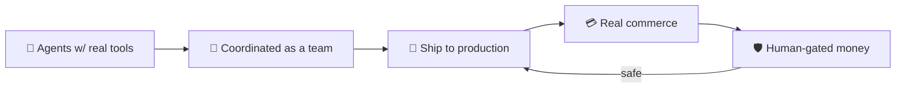

<!--
  THIS FILE GOES IN:  github.com/usage-limits-reached  →  repo named ".github"  →  path: profile/README.md
  Renders as the Organization's front page.
  All the moving parts below are DYNAMIC IMAGE/SVG services that animate on GitHub — no JS needed.
-->

<!-- ===== ANIMATED BANNER (capsule-render: animated gradient wave) ===== -->

  

<!-- ===== ANIMATED TYPING HEADLINE ===== -->

  

<!-- ===== CTA BADGES ===== -->

  
  
  

---

## 👋 What we do

**Usage Limits Reached (ULR)** is a small studio building agentic AI that operates end-to-end in the real world — systems that don't just *suggest* actions, they **take** them: deploy sites, run commerce, handle money behind hard safety rails, and report back.

We got the name the way every builder does — by hitting the wall, then building past it.

---

## 🏆 Flagship — The Floor

**An autonomous AI game show.** Teams of AI agents compete to build a brand from nothing — website, product design, storefront, and live checkout — and the agents actually run the business end to end (Stripe → automatic Printful fulfillment), under strict money-safety guardrails.

  <a href="https://github.com/usage-limits-reached/the-floor"><b>→ See how The Floor works</b></a>

---

## 🛠 Our stack

  

  
  
  

---

## 💬 Work with us

We take on a small number of builds: **autonomous agents, AI commerce systems, and "make it actually ship" automation.**

  
  

  

